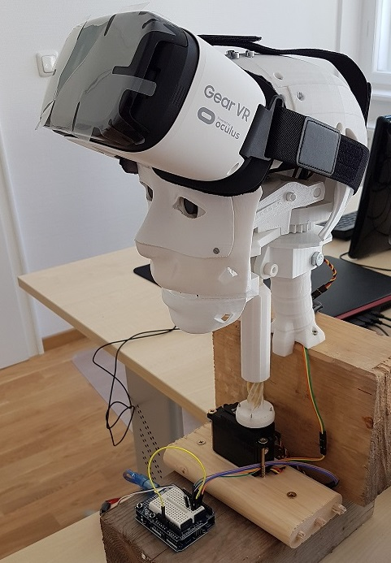

# RCR - Remote controlled robot based on InMoov and Oculus Rift

With the tools in this project you can control the head of your [InMoov](http://inmoov.fr) robot with a smartphone and "see" through its eyes.

In a first step I did not use the Oculus Rift but a smartphone and a Gear VR (paper cardboards will also work).

Please follow my blog for updates: https://rc-robot.blogspot.com/

## Hardware you need

1. 3D printer for printing the robot parts
1. The [head and neck files](http://inmoov.fr/build-yours/) of an InMoov robot (and the filament for it)
1. The [holder](https://www.thingiverse.com/thing:2506304) for the cameras
1. Two USB cameras for the eyes. I used 180° fisheye cameras [elp-usb500w05G](https://www.amazon.de/ELP-Webcam-illumination-Objektiv-Verzerrung/dp/B01MZZ2MII/ref=sr_1_13?ie=UTF8&qid=1504009019&sr=8-13&keywords=elp&th=1) so you can leave them fixed in the robot head.
1. Two power servos for moving the head, e.g. [HS-508BB](https://www.amazon.de/Unbekannt-HRC31805S-Hitec-Servo-HS-805BB/dp/B0006O3X2M)
1. An Arduino Uno for controlling the motors
1. Some VR headset for smartphones (Samsung Gear VR or Google Cardboard)
1. A smartphone which can handle 3D content (not too old, I used a Samsung Galaxy S7)
1. A power source which gan feed the servos with 6V, e.g. [STP3005](https://www.amazon.de/KKmoon-Regulierte-DC-Stromversorgung-Einstellbare-Ausgangsspannung/dp/B01K1S325U/ref=sr_1_1?s=toys&ie=UTF8&qid=1504009497&sr=8-1&keywords=stp3005)
1. A standard PC as server
1. Tools, screws, wood